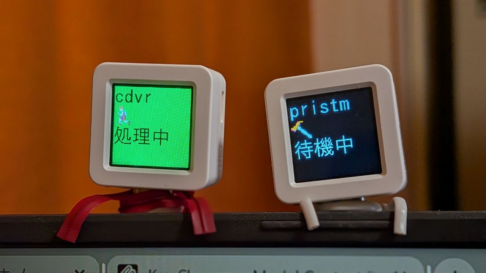

# Notif サーバー



M5 AtomS3をBluetooth経由で制御し、HTTPリクエストでテキストや画像を表示するシステムです。

## 🚀 クイックスタート（実行済みバイナリ使用）

### 1. サーバー起動

#### Linux
```bash
./bin/linux-v5/notif-server-v5
```

#### Windows
```cmd
.\bin\windows-v5\notif-server-v5.exe
```

サーバーが起動すると、ポート18080でHTTPサーバーとMCPサーバーが同時に開始されます。

### 2. AtomS3デバイスの準備

#### AtomS3ファームウェアアップロード

**必要なもの:**
- M5 AtomS3デバイス
- USB-Cケーブル
- PlatformIO または M5Burner

**方法1: PlatformIO（推奨）**
```bash
# PlatformIOインストール（初回のみ）
pip install platformio

# ファームウェアアップロード
cd v5/src/atoms3
pio run --target upload --upload-port /dev/ttyACM0  # Linux
pio run --target upload --upload-port COM3         # Windows
```

**方法2: M5Burner（Windows推奨）**
1. [M5Burner](https://docs.m5stack.com/en/uiflow/m5burner/intro)をダウンロード・インストール
2. USBでAtomS3をPCに接続
3. M5Burner起動 → Device: ATOM S3 選択
4. 「Custom .bin」選択 → `v5/bin/atoms3/atoms3-firmware.bin` 指定
5. PORT（COM番号）選択 → 「Burn」クリック

**方法3: WSL2環境（Linux）**
```bash
# Windows側（管理者PowerShell）
winget install --interactive --exact dorssel.usbipd-win
usbipd list
usbipd bind --busid 2-4
usbipd attach --wsl --busid 2-4

# WSL側
sudo apt install linux-tools-generic hwdata
ls /dev/ttyACM*
pio run -t upload --upload-port /dev/ttyACM0
```

アップロード完了後、デバイス名は `notif_atoms3_XXXXXX` 形式で表示されます。

### 3. 基本的な使い方

**重要**: 以下の例では `localhost` を使用していますが、ネットワーク上の他のデバイスから接続する場合は、サーバーを実行しているPCのIPアドレス（例: `192.168.1.100`）に置き換えてください。

#### Webインターフェース
ブラウザで以下のアドレスにアクセス：
- 同じPC: http://localhost:18080
- ネットワーク内の他のデバイス: http://[サーバーPCのIP]:18080

#### cURLでのAPI使用
```bash
# 基本メッセージ送信
curl -G "http://localhost:18080/send" \
  --data-urlencode "text=Hello World!" \
  --data-urlencode "bgcolor=blue" \
  --data-urlencode "color=white"

# 画像アップロード
curl -X POST http://localhost:18080/api/image/upload \
  -F "image=@your-image.png" \
  -F "device=1"

# URL画像送信
curl -X POST http://localhost:18080/api/image/url \
  -H "Content-Type: application/json" \
  -d '{"url": "https://example.com/image.png", "device": 1}'

# 状態確認
curl http://localhost:18080/status
```

### 4. Claude Code連携

#### Hook設定
Claude Codeでの作業状況をAtomS3に表示できます。

**重要**: Claude Codeを実行しているPCとNotifサーバーが異なる場合は、`localhost` をサーバーPCのIPアドレスに置き換えてください。

**~/.config/claude-code/hooks.json**
```json
{
  "hooks": {
    "tool-call": {
      "command": "curl -G 'http://localhost:18080/send' --data-urlencode 'text=🔧 Tool: {tool}' --data-urlencode 'bgcolor=blue' --data-urlencode 'color=white' --data-urlencode 'size=2'",
      "background": true
    },
    "task-start": {
      "command": "curl -G 'http://localhost:18080/send' --data-urlencode 'text=▶️ Start Task' --data-urlencode 'bgcolor=green' --data-urlencode 'color=white'",
      "background": true
    },
    "task-complete": {
      "command": "curl -G 'http://localhost:18080/send' --data-urlencode 'text=✅ Complete' --data-urlencode 'bgcolor=green' --data-urlencode 'color=white'",
      "background": true
    },
    "error": {
      "command": "curl -G 'http://localhost:18080/send' --data-urlencode 'text=❌ Error' --data-urlencode 'bgcolor=red' --data-urlencode 'color=white'",
      "background": true
    }
  }
}
```

#### シンプル設定例
```json
{
  "hooks": {
    "tool-call": {
      "command": "curl -G 'http://localhost:18080/send' --data-urlencode 'text=⚙️' --data-urlencode 'bgcolor=orange' --data-urlencode 'size=4'",
      "background": true
    }
  }
}
```

## 📁 ディレクトリ構造

```
snotif/
├── bin/                    # 実行済みバイナリ
│   ├── linux-v5/
│   │   └── notif-server-v5
│   └── windows-v5/
│       └── notif-server-v5.exe
├── v5/                     # ソースコード
│   ├── Cargo.toml
│   ├── scripts/
│   └── src/rust/
└── README.md
```

## 🛠️ 開発者向け情報

ソースからビルドする場合は、詳細な手順を **[BUILD.md](BUILD.md)** で確認してください。

### クイックビルド
```bash
# 基本的なビルド手順
cd v5
cargo check                     # 依存関係確認
./scripts/build-linux-v5.sh     # Linux版ビルド
./scripts/build-windows-v5.sh   # Windows版ビルド
```

## 🔧 設定

### 環境変数
```bash
HOST=127.0.0.1          # サーバーホスト
PORT=18080               # サーバーポート
LOG_LEVEL=info          # ログレベル
DEVICE_TIMEOUT=30       # デバイス接続タイムアウト（秒）
```

### config.json (オプション)
```json
{
  "host": "127.0.0.1",
  "port": 18080,
  "log_level": "info",
  "bluetooth": {
    "scan_timeout": 10,
    "connection_timeout": 30
  }
}
```

## 📖 API仕様

### v1 API（互換性維持）
- `GET /send` - 基本メッセージ送信
- `GET /status` - サーバー状態確認

### v2 API（領域ベース描画）
- `GET /api/draw` - 領域指定描画

### 画像API
- `POST /api/image/upload` - 画像アップロード
- `POST /api/image/url` - URL画像送信
- `GET /test-images/{filename}` - テスト画像配信

### MCP（Model Context Protocol）
- Claude DesktopやClaude.aiから直接制御可能
- リソース: デバイス状態、接続状況
- ツール: send, draw, status, devices

## ❓ トラブルシューティング

### デバイスが見つからない
1. AtomS3の電源確認
2. Bluetooth有効化
3. デバイス名が `notif_atoms3_XXXXXX` 形式で表示されることを確認

### Windows BLE問題
- 既存ペアリングを削除
- Windows設定 > デバイス > Bluetooth で一度削除してから再スキャン

### Linux権限問題
```bash
# Bluetoothアクセス権限付与
sudo usermod -a -G bluetooth $USER
# ログアウト/ログインまたは再起動
```

### ビルドエラー
```bash
# 依存関係の再インストール
cargo clean
cargo update
cargo build
```

## 📝 ライセンス

MIT License

---

## 📚 関連ドキュメント

- **[QUICKSTART.md](QUICKSTART.md)** - 5分で始めるクイックスタートガイド
- **[BUILD.md](BUILD.md)** - 詳細なビルド環境構築手順
- **[FIRMWARE.md](FIRMWARE.md)** - AtomS3ファームウェアアップロード手順

